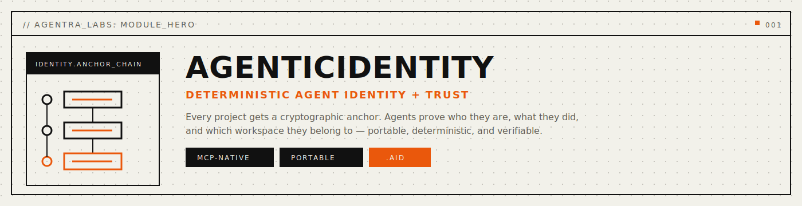
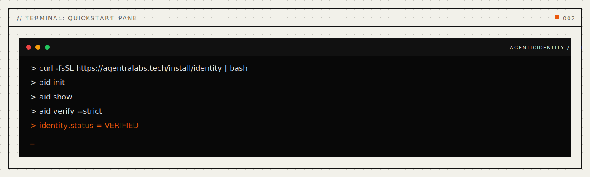
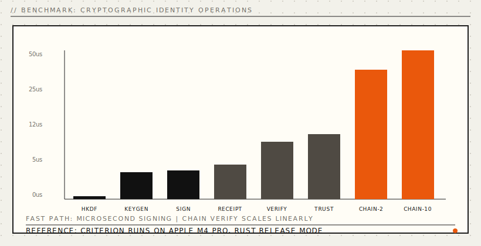
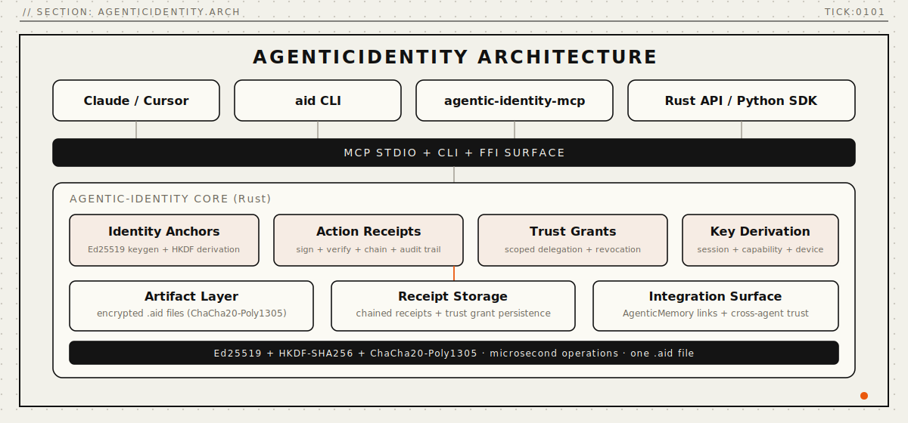

<p align="center">
  
</p>

<p align="center">
  <a href="#install"></a>
  <a href="#install"></a>
  <a href="#mcp-server"></a>
  <a href="LICENSE"></a>
  <a href="paper/paper-i-trust-anchor/agenticidentity-paper.pdf"></a>
  <a href="docs/api-reference.md"></a>
</p>

<p align="center">
  <a href="#quickstart">Quickstart</a> · <a href="#problems-solved">Problems Solved</a> · <a href="#how-it-works">How It Works</a> · <a href="#why-agenticidentity">Why</a> · <a href="#mcp-server">MCP Server</a> · <a href="#benchmarks">Benchmarks</a> · <a href="#install">Install</a> · <a href="docs/api-reference.md">API</a> · <a href="docs/faq.md">FAQ</a> · <a href="paper/paper-i-trust-anchor/agenticidentity-paper.pdf">Paper</a>
</p>

---

## AI agents have no identity.

Your agent makes decisions, calls APIs, deploys code, and accesses sensitive data. But there is no cryptographic proof it did any of it. No way to verify which agent acted. No way to audit what happened. No way to scope what an agent is allowed to do.

API keys are not identity -- they are shared secrets with no audit trail. OAuth tokens are not identity -- they expire and carry no action history. Logging is not identity -- logs can be tampered with and carry no signatures.

**AgenticIdentity** gives every AI agent a permanent, cryptographic identity rooted in Ed25519 key pairs. Agents sign every action they take, producing tamper-evident receipts. Trust between agents is granted, scoped, delegated, and revoked through signed trust grants. Everything is verifiable by anyone with the public key.

<a name="problems-solved"></a>

## Problems Solved (Read This First)

- **Problem:** no way to prove which agent took an action.
  **Solved:** Ed25519 identity anchors produce non-repudiable signed receipts for every action.
- **Problem:** agents share API keys with no individual accountability.
  **Solved:** each agent has its own key pair; derived session and capability keys isolate operations.
- **Problem:** no audit trail survives agent restarts or model switches.
  **Solved:** chained receipts create a persistent, cryptographically linked history.
- **Problem:** no scoped permissions for multi-agent systems.
  **Solved:** trust grants with capability URIs, time bounds, use limits, and delegation depth.
- **Problem:** revoking agent access requires rotating shared secrets.
  **Solved:** individual trust grants are revoked independently without affecting other agents.
- **Problem:** private key material stored in plaintext.
  **Solved:** `.aid` files encrypt keys at rest with ChaCha20-Poly1305 + Argon2id.

```bash
# Create an identity, sign an action, verify, grant trust -- four commands
aid init --name my-agent
aid sign --type decision --description "Approved deployment to production"
aid verify receipt arec_7xK9mP2...
aid trust grant --to aid_4Yn3kL... --capability "read:calendar" --expires 7d
```

Four commands. Cryptographic proof of every action. Scoped trust delegation. One `.aid` file holds the identity. Works with Claude, GPT, Ollama, or any agent you switch to next.

<p align="center">
  
</p>

---

<a name="benchmarks"></a>

## Benchmarks

Rust core. Ed25519 + HKDF-SHA256. Real numbers from Criterion statistical benchmarks:

<p align="center">
  
</p>

| Operation | Time | Throughput |
|:---|---:|---:|
| Ed25519 key generation | **8.80 us** | ~114K / sec |
| Ed25519 sign | **9.17 us** | ~109K / sec |
| Ed25519 verify | **19.34 us** | ~52K / sec |
| HKDF-SHA256 derivation | **972 ns** | ~1M / sec |
| Identity creation | **8.78 us** | ~114K / sec |
| Receipt sign | **11.55 us** | ~87K / sec |
| Receipt verify | **21.77 us** | ~46K / sec |
| Trust grant sign | **12.41 us** | ~81K / sec |
| Trust grant verify | **21.84 us** | ~46K / sec |
| Trust chain verify (depth 2) | **43.51 us** | ~23K / sec |
| Receipt chain (10 receipts) | **123.77 us** | -- |

> All benchmarks measured with Criterion (1000+ iterations) on Apple M4 Pro, macOS, Rust 1.90.0 `--release`. Single-threaded. All operations are independent and scale linearly with cores.

<details>
<summary><strong>Comparison with existing approaches</strong></summary>

<br>

| | API Keys | OAuth Tokens | Signed Logs | **AgenticIdentity** |
|:---|:---:|:---:|:---:|:---:|
| Per-agent accountability | No | Partial | No | **Yes** |
| Tamper-evident | No | No | Partial | **Yes (Ed25519)** |
| Survives model switch | N/A | No | Yes | **Yes** |
| Scoped permissions | No | Partial | No | **Yes (capability URIs)** |
| Delegation chains | No | No | No | **Yes (depth-limited)** |
| Individual revocation | Rotate all | Per-token | No | **Yes (per-grant)** |
| Key derivation | No | No | No | **Yes (HKDF-SHA256)** |
| Encrypted at rest | Varies | N/A | No | **Yes (ChaCha20-Poly1305)** |
| External dependencies | Cloud service | Auth provider | Log service | **None** |

</details>

---

<a name="why-agenticidentity"></a>

## Why AgenticIdentity

**Identity is cryptographic, not administrative.** When an agent proves it took an action, the proof is a mathematical signature -- not a log entry that can be altered, not a token that expired, not a shared key that could have been anyone. Ed25519 signatures are non-repudiable: the agent cannot deny what it signed.

**One file. Truly portable.** Your agent's identity is a single `.aid` file. Copy it. Back it up. Migrate providers. No cloud service, no auth server, no vendor lock-in. The private key is encrypted at rest with ChaCha20-Poly1305.

**Any agent, any time.** Create an identity today with Claude. Use the same identity tomorrow with GPT. Switch to a local model next year. The `.aid` file goes with you.

**Scoped trust, not all-or-nothing.** Trust grants carry capability URIs with wildcard matching (`read:calendar`, `execute:deploy:*`, `*`), time bounds, use limits, geographic constraints, and delegation depth. Revoke one grant without touching the others.

**Receipt chains are audit trails.** Every action receipt can chain to the previous one, creating an immutable sequence. Different agents can contribute to the same chain. Chain verification catches any tampering or broken links.

---

## Ghost Writer

> **New in v0.2.5** -- Auto-syncs identity context to your AI coding tools.

| Client | Config Location | Status |
|:---|:---|:---|
| **Claude Code** | `~/.claude/memory/IDENTITY_CONTEXT.md` | Full support |
| **Cursor** | `~/.cursor/memory/agentic-identity.md` | Full support |
| **Windsurf** | `~/.windsurf/memory/agentic-identity.md` | Full support |
| **Cody** | `~/.sourcegraph/cody/memory/agentic-identity.md` | Full support |

Syncs: active identities, recent receipts, trust grants. **Zero configuration.**

## MCP Hardening

> **New in v0.2.6** -- Production-grade stdio transport.

- Content-Length framing with 8 MiB limit
- JSON-RPC 2.0 validation
- Atomic writes
- No silent fallbacks

---

<a name="how-it-works"></a>

## How It Works

AgenticIdentity is built on three cryptographic primitives: **identity anchors**, **action receipts**, and **trust grants**.

<p align="center">
  
</p>

**Identity Anchors** are Ed25519 key pairs:

| Component | What | Example |
|:---|:---|:---|
| **Identity ID** | Public key fingerprint | `aid_7xK9mP2qR...` |
| **Signing Key** | Ed25519 private key (zeroized on drop) | Encrypted in `.aid` file |
| **Session Key** | HKDF-derived child key | Scoped to one conversation |
| **Capability Key** | HKDF-derived child key | Scoped to one permission |
| **Device Key** | HKDF-derived child key | Scoped to one device |
| **Rotation** | Key replacement with signed authorization | Preserves full history |

**Action Receipts** are signed proofs:

```
[Observation] ──chain_to──> [Decision] ──chain_to──> [Mutation]
  "Error spike"              "Rollback"               "Deployed v2.3"
   signed                     signed                    signed
```

Six action types: `Decision` · `Observation` · `Mutation` · `Delegation` · `Revocation` · `IdentityOperation` · `Custom(String)`

**Trust Grants** are scoped permissions:

```
Alice ──trust──> Bob ──delegate──> Carol
  "read:*"        "read:calendar"
  depth: 2        depth: 1
```

Grants carry: capability URIs with wildcards, time bounds (`not_before`, `not_after`), use limits, geographic constraints, IP allowlists, and configurable revocation channels.

<details>
<summary><strong>Cryptography used</strong></summary>

<br>

| Purpose | Algorithm | Standard |
|:---|:---|:---|
| Identity keys & signing | Ed25519 | RFC 8032 |
| Key derivation | HKDF-SHA256 | RFC 5869 |
| Private key encryption | ChaCha20-Poly1305 | RFC 8439 |
| Passphrase stretching | Argon2id | RFC 9106 |
| Content hashing | SHA-256 | FIPS 180-4 |
| ID encoding | Base58, Base64 | -- |

No custom cryptography. All primitives are from audited, widely-used Rust crates (`ed25519-dalek`, `hkdf`, `chacha20poly1305`, `argon2`).

</details>

<details>
<summary><strong>.aid file format</strong></summary>

<br>

```json
{
    "version": 1,
    "format": "aid-v1",
    "encryption": {
        "algorithm": "chacha20-poly1305",
        "kdf": "argon2id",
        "salt": "<base64-16-bytes>",
        "nonce": "<base64-12-bytes>"
    },
    "encrypted_anchor": "<base64-ciphertext>",
    "public_document": {
        "id": "aid_...",
        "public_key": "<base64-32-bytes>",
        "algorithm": "ed25519",
        "created_at": 1719840000000000,
        "name": "my-agent",
        "rotation_history": [],
        "attestations": [],
        "signature": "<base64-self-signature>"
    }
}
```

The public document is stored in plaintext for inspection without the passphrase. The private key is encrypted with ChaCha20-Poly1305 using a key derived from the passphrase via Argon2id (64 MiB, 3 iterations, 4 lanes) + HKDF-SHA256. All intermediate key material is zeroized immediately after use.

[Full format specification ->](docs/file-format.md)
</details>

---

<a name="install"></a>

## Install

**One-liner** (desktop profile, backwards-compatible):
```bash
curl -fsSL https://agentralabs.tech/install/identity | bash
```

Downloads a pre-built `agentic-identity-mcp` binary to `~/.local/bin/` and merges the MCP server into your Claude Desktop and Claude Code configs. Identity defaults to `~/.agentic-identity/`. Requires `curl` and `jq`.
If release artifacts are not available, the installer automatically falls back to `cargo install --git` source install.

**Environment profiles** (one command per environment):
```bash
# Desktop MCP clients (auto-merge Claude Desktop + Claude Code when detected)
curl -fsSL https://agentralabs.tech/install/identity/desktop | bash

# Terminal-only (no desktop config writes)
curl -fsSL https://agentralabs.tech/install/identity/terminal | bash

# Remote/server hosts (no desktop config writes)
curl -fsSL https://agentralabs.tech/install/identity/server | bash
```

| Channel | Command | Result |
|:---|:---|:---|
| GitHub installer (official) | `curl -fsSL https://agentralabs.tech/install/identity \| bash` | Installs release binaries when available, otherwise source fallback; merges MCP config |
| GitHub installer (desktop profile) | `curl -fsSL https://agentralabs.tech/install/identity/desktop \| bash` | Explicit desktop profile behavior |
| GitHub installer (terminal profile) | `curl -fsSL https://agentralabs.tech/install/identity/terminal \| bash` | Installs binaries only; no desktop config writes |
| GitHub installer (server profile) | `curl -fsSL https://agentralabs.tech/install/identity/server \| bash` | Installs binaries only; server-safe behavior |
| crates.io paired crates (official) | `cargo install agentic-identity-cli agentic-identity-mcp` | Installs `aid` and `agentic-identity-mcp` |
| PyPI (SDK) | `pip install agentic-identity` | Python SDK wrapping FFI |
| npm (wasm) | `npm install @agenticamem/identity` | WASM-based identity SDK for Node.js and browser |

### Server auth and artifact sync

For cloud/server runtime:

```bash
export AGENTIC_TOKEN="$(openssl rand -hex 32)"
```

All MCP clients must send `Authorization: Bearer <same-token>`.
If `.aid` files are on another machine, sync them to the server first.

| Goal | Command |
|:---|:---|
| **Just give me identity** | Run the one-liner above |
| **Python developer** | `pip install agentic-identity` |
| **Rust developer** | `cargo install agentic-identity-cli agentic-identity-mcp` |
| **From source** | `git clone ... && cargo build --release` |

<details>
<summary><strong>Detailed install options</strong></summary>

<br>

**Rust:**
```bash
cargo install agentic-identity-cli       # CLI (aid)
cargo install agentic-identity-mcp       # MCP server
```

**Rust library:**
```toml
[dependencies]
agentic-identity = "0.2.3"
```

**Python:**
```bash
pip install agentic-identity
```

**From source:**
```bash
git clone https://github.com/agentralabs/agentic-identity.git
cd agentic-identity
cargo build --release
```

</details>

## Deployment Model

- **Standalone by default:** AgenticIdentity is independently installable and operable. Integration with AgenticMemory, AgenticVision, or AgenticCodebase is optional, never required.
- **Autonomic operations by default:** runtime maintenance uses safe defaults with encrypted storage, key rotation scheduling, and health-ledger snapshots.

| Area | Default behavior | Controls |
|:---|:---|:---|
| Identity storage | Encrypted `.aid` files in `~/.agentic-identity/` | `AID_IDENTITY_DIR` |
| Receipt storage | Local receipt directory | `AID_RECEIPT_DIR` |
| Trust storage | Local trust delegation directory | `AID_TRUST_DIR` |
| Server auth gate | Requires `AGENTIC_TOKEN` in server mode | `AGENTIC_TOKEN` |
| Health ledger | Periodic operational snapshots (default: `~/.agentra/health-ledger`) | `AID_HEALTH_LEDGER_DIR`, `AGENTRA_HEALTH_LEDGER_DIR` |
| Log level | Info | `AID_LOG_LEVEL` |

---

<a name="mcp-server"></a>

## MCP Server

**Any MCP-compatible client gets instant access to cryptographic identity.** The `agentic-identity-mcp` crate exposes the full AgenticIdentity engine over the [Model Context Protocol](https://modelcontextprotocol.io) (JSON-RPC 2.0 over stdio).

```bash
cargo install agentic-identity-mcp
```

### Configure Claude Desktop

Add to `~/Library/Application Support/Claude/claude_desktop_config.json`:

```json
{
  "mcpServers": {
    "agentic-identity": {
      "command": "agentic-identity-mcp",
      "args": ["--identity-dir", "~/.agentic-identity"]
    }
  }
}
```

### Configure VS Code / Cursor

Add to `.vscode/settings.json`:

```json
{
  "mcp.servers": {
    "agentic-identity": {
      "command": "agentic-identity-mcp",
      "args": ["--identity-dir", "~/.agentic-identity"]
    }
  }
}
```

### What the LLM gets

| Category | Count | Examples |
|:---|---:|:---|
| **Tools** | 13 | `identity_create`, `action_sign`, `action_verify`, `chain_verify`, `trust_grant`, `trust_verify`, `trust_revoke`, `key_derive_session`, `key_derive_capability`, `action_context` ... |

Once connected, the LLM can create identities, sign action receipts, verify chains, grant and revoke trust, derive scoped keys, and maintain audit trails -- all backed by Ed25519 cryptography. [Full MCP docs ->](docs/integration-guide.md)

---

<a name="quickstart"></a>

## Quickstart

### CLI -- four commands

```bash
# Install
curl -fsSL https://agentralabs.tech/install/identity | bash

# Create an identity
aid init --name my-agent

# Sign an action
aid sign --type decision --description "Approved deployment to production"

# Verify a receipt
aid verify receipt arec_7xK9mP2...

# Grant trust to another agent
aid trust grant --to aid_4Yn3kL... --capability "read:calendar" --expires 7d
```

### Rust -- create, sign, verify

```rust
use agentic_identity::identity::IdentityAnchor;
use agentic_identity::receipt::action::{ActionContent, ActionType};
use agentic_identity::receipt::receipt::ReceiptBuilder;
use agentic_identity::receipt::verify::verify_receipt;

// Create identity
let agent = IdentityAnchor::new(Some("my-agent".to_string()));

// Sign an action
let receipt = ReceiptBuilder::new(
    agent.id(),
    ActionType::Decision,
    ActionContent::new("Approved deployment to production"),
)
.sign(agent.signing_key())
.unwrap();

// Verify
let result = verify_receipt(&receipt).unwrap();
assert!(result.is_valid);
```

### Python -- three lines

```python
from agentic_identity import Identity, Receipt

identity = Identity(name="my-agent")
receipt = Receipt.sign(identity, action_type="decision", description="Approved deployment")
assert receipt.verify()
```

### Same identity, different LLMs

```bash
# Monday: Claude signs a decision
# (agent calls identity_create + action_sign via MCP)

# Tuesday: GPT verifies the receipt and continues the chain
# (agent calls action_verify + action_sign via MCP, same .aid file)
```

---

## Common Workflows

1. **Audit an agent's actions** -- After a production incident, verify the full receipt chain:
   ```bash
   aid verify chain --identity my-agent --from arec_first... --to arec_last...
   ```

2. **Scope agent permissions** -- Before deploying a worker agent, grant only what it needs:
   ```bash
   aid trust grant --to aid_worker... --capability "execute:deploy:staging" --expires 24h --max-uses 5
   ```

3. **Rotate after compromise** -- If a key is exposed, rotate immediately:
   ```bash
   aid rotate --reason compromised
   ```
   The old key signs the transition. Trust grants remain verifiable through the rotation chain.

4. **Multi-agent audit trail** -- Link receipts from different agents into one chain:
   ```bash
   aid sign --type observation --description "Error spike detected" --chain-to arec_prev...
   # Different agent continues the chain:
   aid sign --type decision --description "Initiating rollback" --chain-to arec_observation...
   ```

---

## Validation

| Suite | Tests | Notes |
|:---|---:|:---|
| Rust core library | **175** | Identity, receipts, trust, crypto, storage |
| CLI integration | **32** | End-to-end CLI workflows |
| MCP server | **45** | Protocol, tools, sessions, edge cases |
| FFI bindings | **18** | C API correctness |
| Python SDK | **19** | Wrapper validation |
| **Total** | **289** | All passing |

**One research paper:**
- [Paper I: AgenticIdentity -- Cryptographic Trust Anchor for AI Agents](paper/paper-i-trust-anchor/agenticidentity-paper.pdf)

---

## Repository Structure

This is a Cargo workspace monorepo containing the core library, CLI, MCP server, and FFI bindings.

```
agentic-identity/
├── Cargo.toml                    # Workspace root
├── crates/
│   ├── agentic-identity/         # Core library (crates.io: agentic-identity v0.2.3)
│   ├── agentic-identity-cli/     # CLI tool: aid (crates.io: agentic-identity-cli v0.2.3)
│   ├── agentic-identity-mcp/     # MCP server (crates.io: agentic-identity-mcp v0.2.3)
│   └── agentic-identity-ffi/     # C FFI bindings (crates.io: agentic-identity-ffi v0.2.3)
├── python/                       # Python SDK (PyPI: agentic-identity)
├── tests/                        # Integration + stress tests
├── benches/                      # Criterion benchmarks
├── paper/                        # Research paper
├── examples/                     # Rust usage examples
└── docs/                         # Quickstart, API ref, concepts, benchmarks, file format
```

### Running Tests

```bash
# All workspace tests (unit + integration)
cargo test --workspace

# Core library only
cargo test -p agentic-identity

# MCP server only
cargo test -p agentic-identity-mcp

# Benchmarks
cargo bench -p agentic-identity
```

---

## Roadmap: Next -- Remote Server Support

The next release is planned to add HTTP/SSE transport for remote deployments. Track progress in [#1](https://github.com/agentralabs/agentic-identity/issues/1).

| Feature | Status |
|:---|:---|
| `--token` bearer auth | Planned |
| `--multi-tenant` per-user identity dirs | Planned |
| `/health` endpoint | Planned |
| `--tls-cert` / `--tls-key` native HTTPS | Planned |
| `delete` / `export` / `compact` CLI commands | Planned |
| Docker image + compose | Planned |
| Remote deployment docs | Planned |

Planned CLI shape (not available in current release):

```text
agentic-identity-mcp serve-http --identity-dir /data/identities --port 8082 --token "<token>"
agentic-identity-mcp serve-http --multi-tenant --data-dir /data/users --port 8082 --token "<token>"
```

---

## The .aid File

Your agent's identity. Continuous. Verifiable.

| | |
|-|-|
| Size | ~0.5-1 GB over 20 years |
| Format | Cryptographic chain |
| Works with | Any model needing accountability |

## v0.2: Grounding & Workspaces

**Grounding**: Agent cannot claim permission without trust grant evidence.

**Workspaces**: Compare permissions across agents.

---

## Contributing

See [CONTRIBUTING.md](CONTRIBUTING.md). The fastest ways to help:

1. **Try it** and [file issues](https://github.com/agentralabs/agentic-identity/issues)
2. **Add an integration** -- connect AgenticIdentity to a new agent framework
3. **Write an example** -- show a real use case
4. **Improve docs** -- every clarification helps someone

---

## Privacy and Security

- All identity data stays local in `.aid` files -- no telemetry, no cloud sync by default.
- Private keys are encrypted at rest with ChaCha20-Poly1305 + Argon2id passphrase derivation.
- Key material is zeroized in memory on drop -- intermediate keys are never retained.
- No custom cryptography: Ed25519, HKDF-SHA256, ChaCha20-Poly1305, Argon2id (all RFC-standard, audited Rust crates).
- Server mode requires an explicit `AGENTIC_TOKEN` environment variable for bearer auth.
- Error messages never include private key material.

---

<p align="center">
  <sub>Built by <a href="https://github.com/agentralabs"><strong>Agentra Labs</strong></a></sub>
</p>
